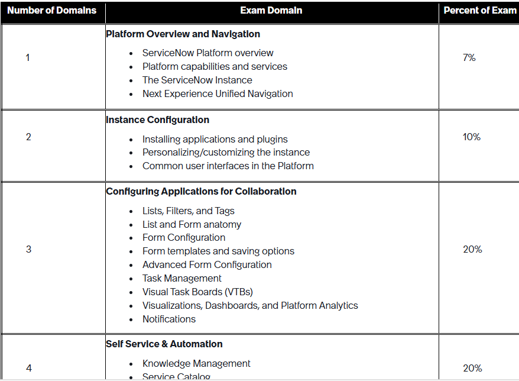
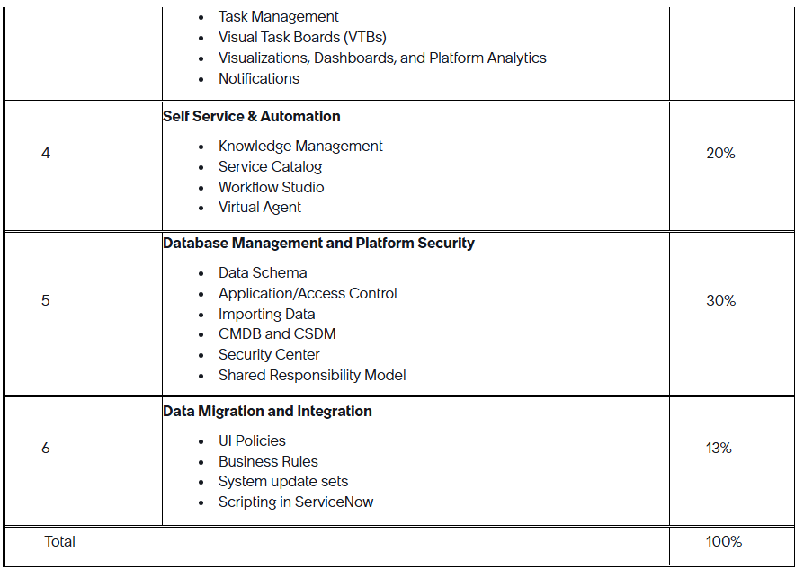

Updated January 2026
 

Introduction
The ServiceNow Certified System Administrator Exam Specification document defines the purpose, audience, testing options, exam content coverage, test framework, and prerequisites for earning the Certified System Administrator certification.

 

Exam Purpose
The ServiceNow Certified System Administrator exam confirms you have the knowledge and skills to configure, implement, and maintain the ServiceNow system. This certification validates their ability to navigate the platform, configure applications, manage databases, and implement self-service and automation. Certified individuals handle data migration, integrations, and customizations to support efficient and scalable ServiceNow operations. 

 

Exam Audience
The ServiceNow Certified System Administrator exam is available to ServiceNow customers, partners, employees, and others interested in becoming a ServiceNow Certified System Administrator. Here is the recommended experience:

Industry experience with database concepts and system management. 
System administrator role and/or access to ServiceNow administrative applications and modules. 
Some knowledge of IT Help Desk processes and the incident, problem, and change workflows are also helpful. 
Three to six months of experience using and/or maintaining a ServiceNow instance.
 

Exam Preparation
Exam questions are based on official ServiceNow training materials and the ServiceNow Product documentation. Study materials posted elsewhere online are not official and should not be used to prepare for the examination.

ServiceNow recommends completing these training course(s) in preparation for the Certified System Administrator exam.

Welcome to ServiceNow
ServiceNow Administration Fundamentals
 

Additional Resources
In addition to the above, these additional resources are valuable in preparation for the exam.

Credentialing Program Guide – a resource to guide you through the entire certification process

Exam Scope
This table shows the exam domains, weightings, sub-topics, and the percentage of questions represented in each domain. The listed sub-skills should NOT be considered an all-inclusive list of the exam content. 

Exam Registration

Step 1: Register for your exam 

Registration = payment. This step secures your exam attempt. Learning credits and credit card payments are accepted. Instructor-led training completion includes one free exam attempt. Discounted exam pricing may be available through associated company benefits.  
Click here to register for the CSA exam. 
You can register at any time. Once registered, you have 90 days to schedule and complete your exam. 
Exam fees are non-refundable. Register only when you are prepared to schedule your exam. 

Step 2: Schedule your exam 

Click here to register for the CSA exam. Note: ServiceNow provides reasonable accommodation to individuals with disabilities or English as a Second Language (ESL) while taking the certification exam. 

Schedule within 90 days. After registration, you must schedule your exam appointment and complete your exam within 90 days. 
 
Step 3: Choose your exam delivery method 

From the My Exams page, you will be directed to Pearson.
Choose to take your exam at a Pearson test center or online with OnVUE, where proctors observe via a webcam. 
 

Step 4: Complete your exam  

 If you do not complete your exam within 90 days, your registration will expire, and you will need to register and pay the full exam fee again (start at step 1 again). 
 

Exam Structure
Exam Duration
The exam duration is 90 minutes.

Number of Items
The exam consists of 60 questions.

 

Multiple Choice (single answer)
For each multiple-choice question on the exam, there are at least three possible responses. Select the correct response. 

Multiple Select (select all that apply)
There are at least four possible responses for each multiple-select question on the exam. The question will state how many responses should be selected. Select ALL correct responses. Partial credit is not provided.

 

Exam Result
An exam result notification is immediately displayed as a *conditional pass or fail after completing and submitting the exam.  

In addition, an exam result report is available and shows your exam result and the percentage of items in each section you answered correctly. Your exam result is conditional, meaning your results are preliminary and may be updated upon final review.  

*A conditional result means the exam can be audited and reviewed at any time, and the certification may be revoked after investigation if it is found that the ServiceNow Test Security Policies have been violated.    

 Understanding Your Results: 
 
Each question on the exam is worth one point. Your total score is compared to a predetermined cut score - this score is not publicly shared and is not always 70%  - to determine a pass or fail outcome. The section percentages on the exam result notification show how you performed in each domain, but they do not determine your overall result, should not be averaged, and do not indicate expertise. 

If You Pass: 
You will earn the Certified System Administrator certification and receive a Credly digital badge to showcase your achievement. 

To maintain your certification, complete annual maintenance exams (deltas) and pay the yearly Certification Maintenance Program (CMP) fee.
 

If You Do Not Pass: 

Review the exam blueprint and the recommended training before retaking the exam. 
The retake policy requires a waiting period between attempts and payment of the exam fee for each attempt. 
Refer to the Credentialing Program Guide for full retake details.
 
 

Sample Questions
Sample Item #1
Which of these applications is available to all users? 

A. Change 

B. Incident 

C. Facilities 

D. Self Service 

Answer: D

 

Sample Item #2
Which module displays a list of tasks assigned to a user’s group, but not yet assigned to an individual user? 

A. My Teams Work 

B. My Groups Work 

C. My Groups Tasks 

D. My Teams Tasks 

Answer: B

 

Sample Item #3
What is the definition of transform maps in ServiceNow?

A. A map that is used to store the history of the incident records 

B. A map used to add data to encrypted fields 

C. A map used to trigger Business Rules before the data is queued in the outbound Web Service 

D. A map to determine relationships between fields displaying in an Import Set to fields in an existing table 

Answer: D

 

Sample Item #4
Multiple Choice, Single Line Text, and Select Box are what type of elements in ServiceNow? 

A. Order Guides 

B. Request Types 

C. Variable Types 

D. Related Lists 

Answer: C

 

Sample Item #5
What is the language used for scripting in ServiceNow? 

A. Java 

B. AngularJS 

C. JavaScript 

D. Jelly 

Answer: C