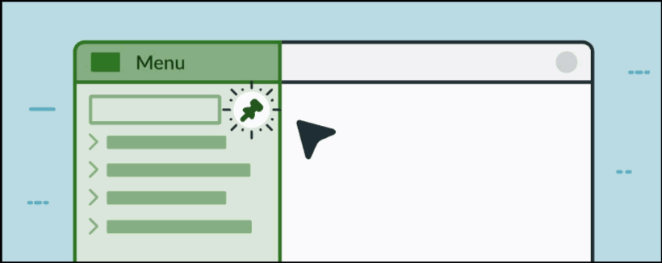

Next Experience Unified Navigation

Next Experience UI-The ServiceNow Next Experience Unified Navigation is the main way for users to interact with the applications and information in a ServiceNow instance. The Unified Navigation features offered through the Next Experience helps you navigate and access components of ServiceNow. Notable Next Experience features include real-time form updates, user presence, and menus for easy access to all applications, modules, in addition to menus for your favorites, history, and workspaces.  

Next Experience provides the tools you need to navigate your instance and set your preferences. With Next Experience, you can: 
Onboard: Get acquainted with the UI
Generate visualizations of your work: See where you can start working and navigate to your tasks
Explore useful features: Explore additional features and resources in the Platform

Unified Navigation header

1.All menu
Your go-to for all applications and modules in the Platform.

2.Favorites
Displays items that you have added as favorites. Select the Edit (pencil) icon to customize your list of favorites.

3.History
The History menu is a scrolling view of recent activities including: 

-  forms and lists accessed

-  catalog items

-  homepages visited

4.Workspaces
The Workspaces menu is a list of workspaces you have access to. NOTE: This menu item displays only if you have access to a workspace. If you have access to only one workspace, the name of that workspace will display in the header (ex. Agent Workspace, Asset Workspace, or CMDB Workspace). 

5. Contextual App Pill
The Contextual App Pill provides the context for where you are in the instance. You can select the star icon to favorite the displayed page. 

6.Global Search
Search for information across applications and records. The Global Search is the quickest way to locate an individual record

7.sidebar discussions
Opens the Sidebar discussions window. You start a new discussion, or browse All, Unread, Record-related, Mentions, and Favorite messages.

8.Embedded Help
Open the help panel for embedded help, feedback, and related articles where available. If there is no embedded help available, you can always search ServiceNow Product Documentation to find resources. 

9.Notifications
View and personalize notifications that are applicable to you across your instance at a central location. Your notifications are based on your access in the Platform.

10.User Menu
Provides options to access your profile. This is also where you may personalize your instance, set display, explore accessibility, and log out. 