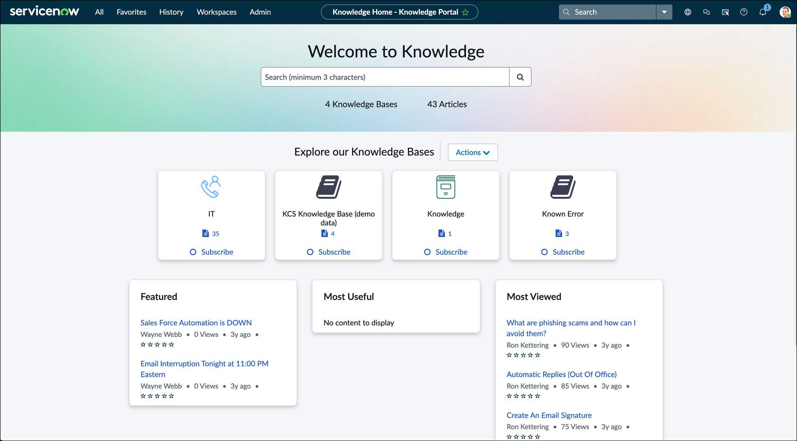
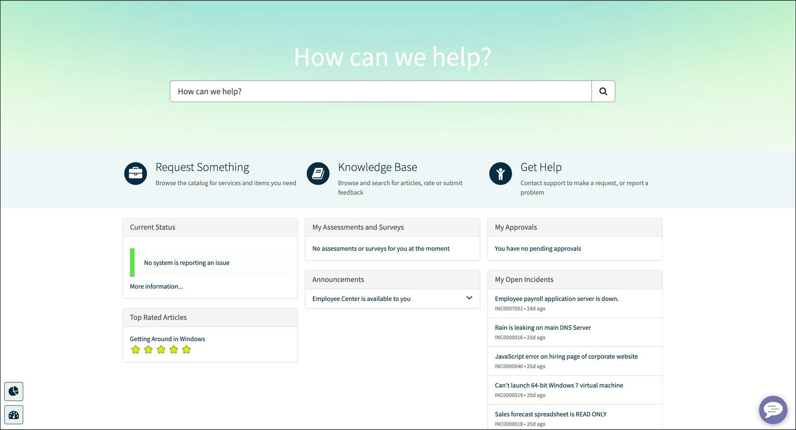
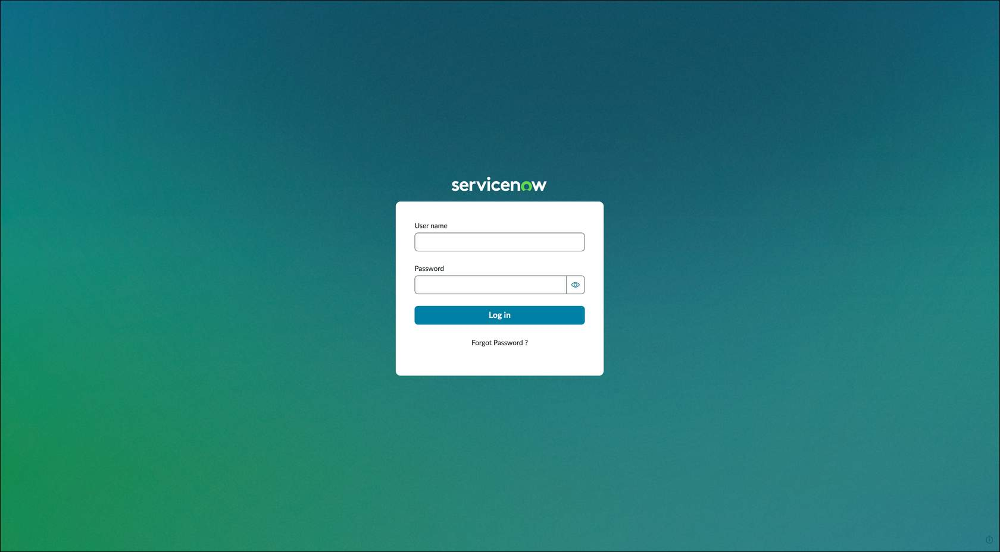
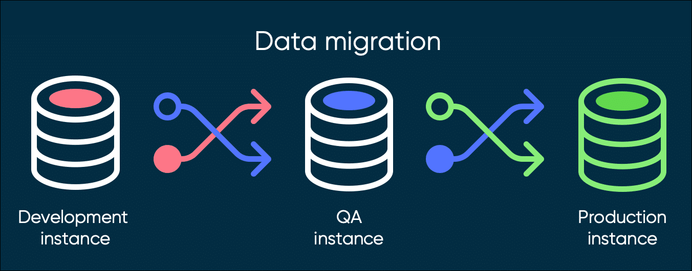
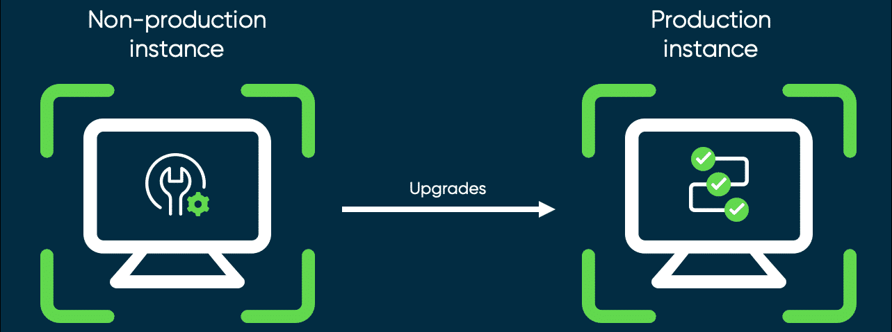
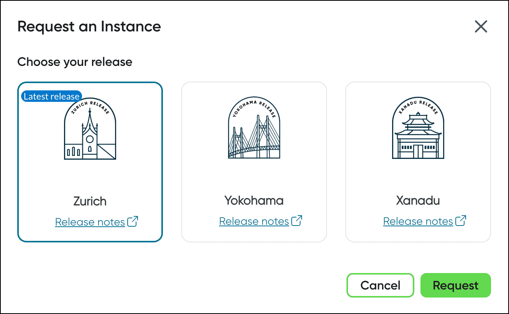

This course is for everyone!
No matter your job role or function, this course will set you up for success to dive deeper into the ServiceNow AI Platform and explore different areas that support completing day-to-day tasks on the job. 

This course is intended to provide you with a basic overview of several topics covering everything from the user interface (UI) to how to submit requests to get help using the Service Catalog.

What to expect in "Welcome to ServiceNow"

The Now Platform User Interface (UI) is called the Next Experience. The Next Experience unifies your instance and enables you to explore apps and access items for your daily tasks.

Lists and Filters
View how lists of records are displayed and determine which records appear in a list by applying a set of conditions.

Forms
A form displays information through fields and is where agents do most of their work. 

Tasks
Defined activities in the Platform that people do to complete their work. 

Platform Analytics
Create and distribute visualizations that show the current state of instance data.

Knowledge Management
Allows for the sharing of information in the Platform through articles for self-help, troubleshooting, and task resolution. 

Service Catalog
You can browse catalog items to request services and product offerings in the Platform.

Virtual Agent
Virtual Agent makes it easy for employees and customers to resolve issues fast and get what they need. It allows users to unlock productivity through a friendly messaging interface, powered by artificial intelligence (AI). 

questions 
1. Where would you go to explore course options depending on the roles that you're interested in? ServiceNow University (learning.servicenow.com)
2. Which job role or function can benefit from completing Welcome to ServiceNow? Any role or function

ServiceNow AI Platform capabilities and services
1.Provides all users with high-performance business services that makes work better for you!
2.Collaborate with your colleagues and share data across the enterprise by interacting in a single instance.
3.Provides reliable multi-instance cloud services

ServiceNow provides these services to its users from a configurable web-based user interface, built on top of a flexible data schema (organized data). The Platform and the applications that run on it use a single system of records to consolidate your organization's business processes. The single data model integrates easily with other enterprise systems and supports a wide variety of plug-and-play applications. You can also build custom applications.

With ServiceNow, you can choose from our workflows: Creator, Industry, Information Technology (IT), Finance and Supply Chain, Employee, and Customer workflows.

//
ServiceNow AI Platform interfaces 

The ServiceNow AI Platform has a number of interfaces you can interact with. Take a look at each tab below to learn more about a few of the different interfaces you may experience with ServiceNow.

1.The next experiences navigation is the primary way to interact with applications, records, and data in a ServiceNow instance. Access lists, forms, updates, applications, links, history, workspaces, and landing pages. 

2.Now Mobile App - enables employees to submit incidents and requests, manage tasks, and access company resources from anywhere! Through the mobile app, a user can also ,Upload images and attachments,Sign documents ,Take surveys,View and report issues,View and complete tasks.

3.The Service Portal provides a user-friendly self-service experience by providing access to specific features using widgets. Service Portal is a great way for external (and existing, legacy) customers to engage with the Platform. When accessing the portal via web browser, type: https//<instance-name-here>.service-now.com/sp. Users can: Search for articles, catalog items, and records ,Submit requests
Browse the corporate news feed, and more! To return back to the Platform view from the Service Portal, remove the "/sp" from your browser URL

//The ServiceNow instance
What is an instance?
When you are accessing ServiceNow, you are accessing an instance of the Platform. An organization can have several instances (e.g., Development, Quality Assurance (QA), Test, and Production) and each instance is a single implementation of the ServiceNow AI Platform. In this course, we provide a (simulator) instance for you to play around in the Platform as you go through each lesson. 

1. notes on instance , An instance in the Platform is independent, changeable, and highly configurable. If you can dream it, you can do it! 

2. Your data is protected, Your data isn't mingled in the same database as another organization's data or other ServiceNow customers. 

3. Easy to migrate , Each instance has customer data that can be exchanged between other instances. For example, it is easy for data to be migrated from a Development instance to QA, to a Production instance.

4. Instance upgrades -Upgrades are made on individual instances. Upgrade a Non-Production (Development or other) instance to complete testing before upgrading to Production. 

5. Releases - Every six months, ServiceNow has a new release. 

6. sum up 
ServiceNow utilizes an advanced architecture as the default offering for customers. This means that an instance features an individual database containing data, applications, and customizations. 

Each customer organization receives a minimum of two instances of ServiceNow: Production and Sub-production. Speak with your System Administrator to learn more!

To access the Platform, a user navigates to a secure, unique URL: https//<instance-name-here>.service-now.com from a supported web browser. 

For a list of supported browsers, visit ServiceNow Product Documentation

ServiceNow Product Documentation is your one-stop shop for topics, products, release notes and upgrades, and product accessibility. If there is a topic you would like more information on, visit Product Docs to learn more!

questions

1. What are four workflows you can choose from with ServiceNow? Four workflows within ServiceNow are IT Workflows, Employee Workflows, Customer Workflows, and Creator Workflows.

2. Which ServiceNow AI Platform interface improves employee productivity and is a platform for communication, engagement, and content experiences?
The Employee Center improves employee productivity and is a platform for communication, engagement, and content experiences. 