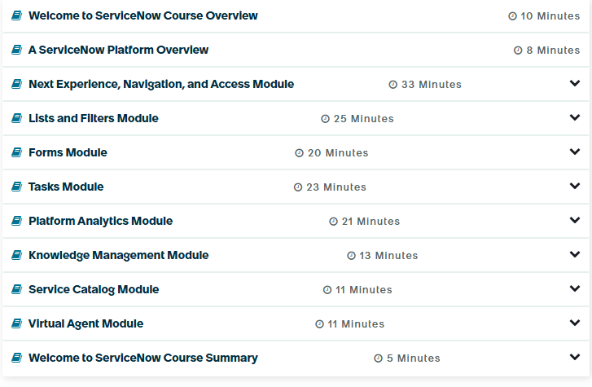

What to expect in "Welcome to ServiceNow"

In each course, you will find lessons and may watch short videos walking you through the ServiceNow Platform. Take a look at the list of topics below by selecting the plus sign (+) or select the left and right arrows to learn more about each. To move to the next item, you may either select the plus sign again to close the text box or use the left and right arrows in the top right corner of the text box.

Welcome to ServiceNow Course Overview -An overview of what to expect in the Welcome to ServiceNow course. You are here!

ServiceNow Platform Overview - Interact with applications and data using the ServiceNow Platform. 

Next Experience, Navigation, and Access - The Now Platform User Interface (UI) is called the Next Experience. The Next Experience unifies your instance and enables you to explore apps and access items for your daily tasks.

Lists and Filters- View how lists of records are displayed and determine which records appear in a list by applying a set of conditions.

 forms- displays information through fields and is where agents do most of their work. 

 Tasks- Defined activities in the Platform that people do to complete their work. 

 Platform Analytics- Create and distribute visualizations that show the current state of instance data.

 Knowledge Management- Allows for the sharing of information in the Platform through articles for self-help, troubleshooting, and task resolution. 

 Service Catalog - You can browse catalog items to request services and product offerings in the Platform.

 Virtual Agent - Virtual Agent makes it easy for employees and customers to resolve issues fast and get what they need. It allows users to unlock productivity through a friendly messaging interface, powered by artificial intelligence (AI). 

 Additional ServiceNow Resources- Resources to help you through your ServiceNow journey and beyond!