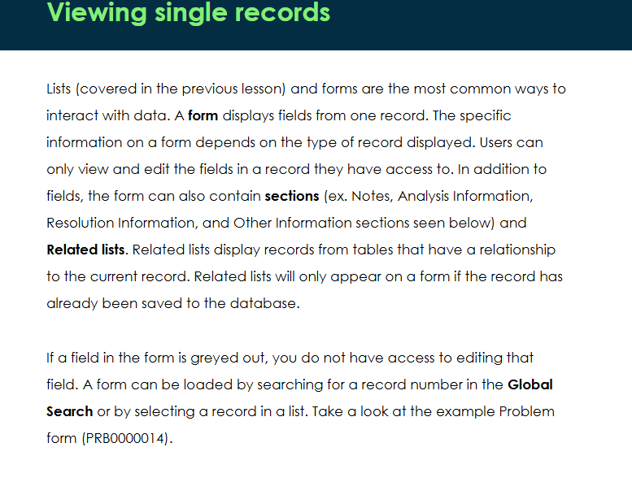
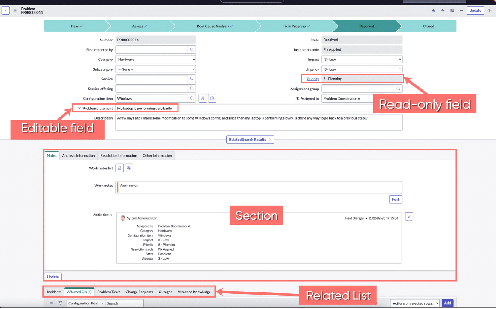
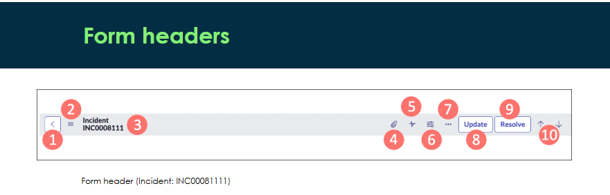
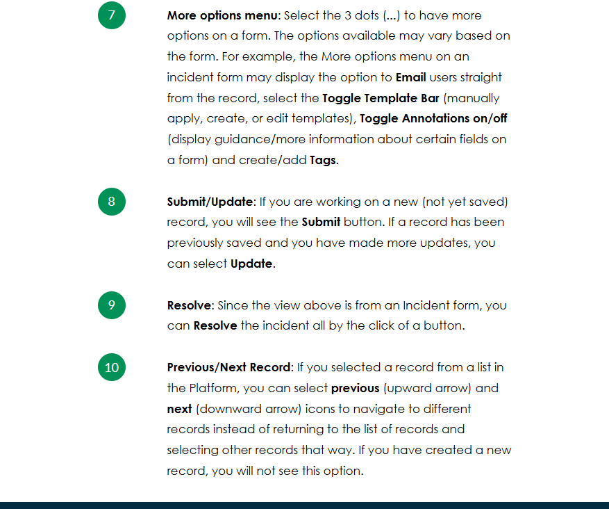
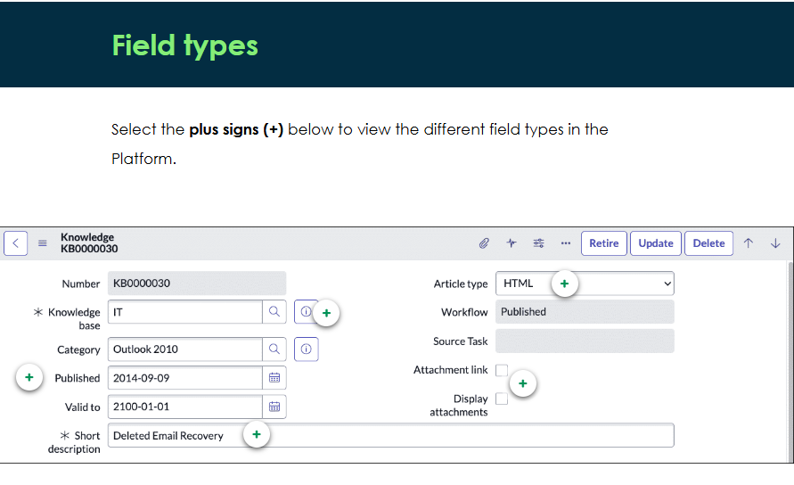
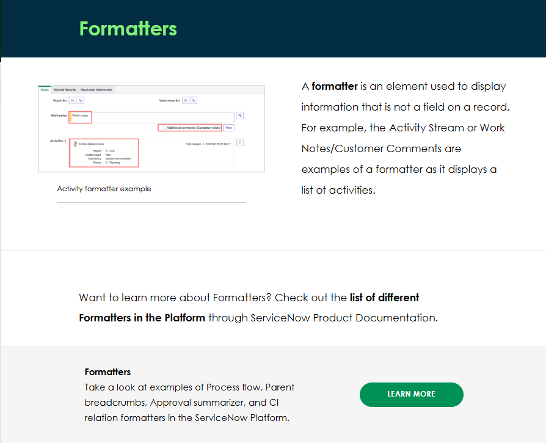
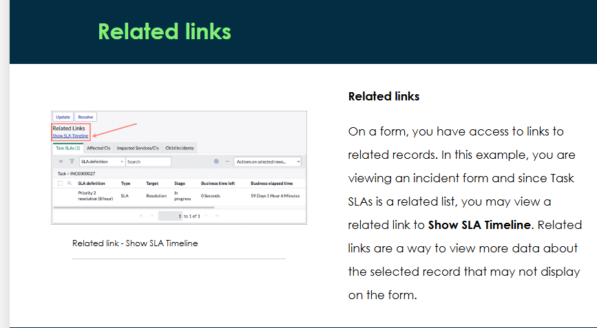

Form Anatomy

headers

reference -Query that displays records from another table. By selecting the reference icon, you can preview and open a record from another table in the Platform.

Choice - Drop-down list of choices that apply to whichever form you are on. These choice fields are pre-populated. 

True/False -A field that appears as a check box. If the checkbox is checked, then the field value is true. If not, then it is false.

String
Freely populated using letters, numbers, and special characters. For 254 characters or less, the string field will be a single-line text field. Anything 255 characters or over will appear as a multi-line text box. 

Date/Time
Day and time of day, which can be selected with a calendar widget. Depending on the record, some calendar widgets may not display the time and will only display the date (as seen in this photo). 

