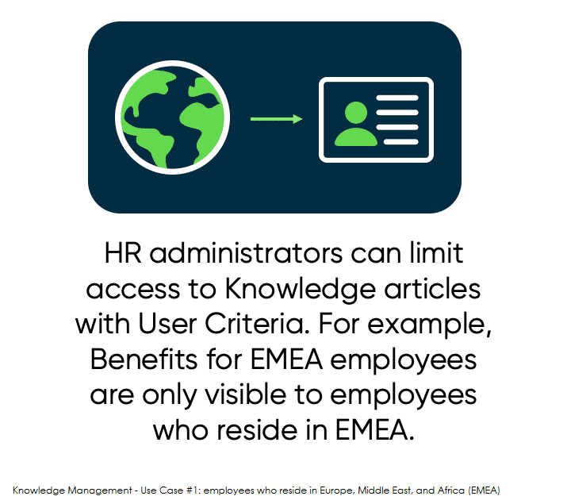
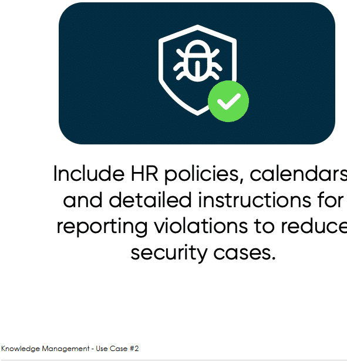
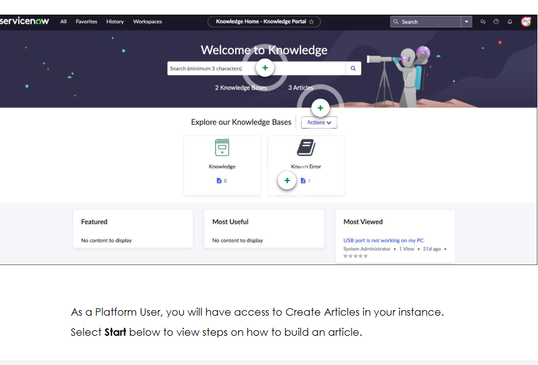
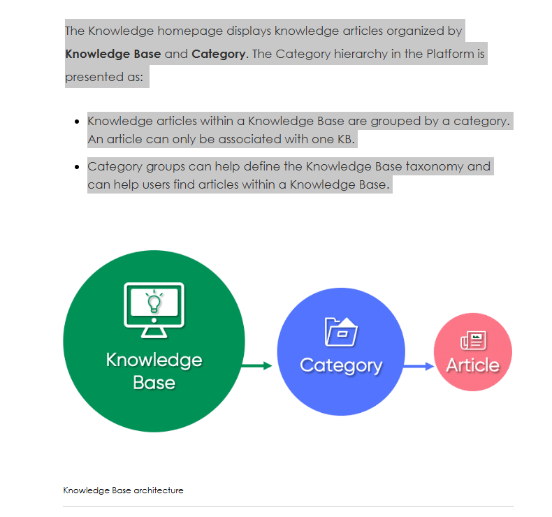
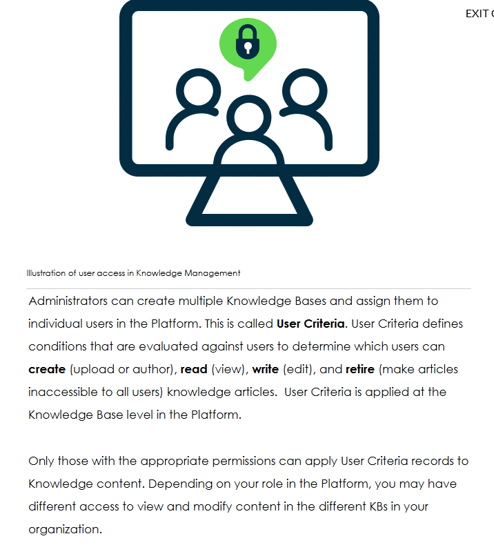

The Knowledge Management application in the Platform enables the sharing and viewing of information in the form of articles. Users have access to Knowledge Bases (KB) where they may interact with useful content related to their daily work tasks. In this course you will discover the following areas of Knowledge Management in the Platform: 

Explore the Knowledge homepage

View illustrations of the KB architecture 

Identify Knowledge Management roles

Rate articles and provide feedback for content

See what access you have as a Platform User

Knowledge Management allows users to create, categorize, review, approve, and browse important information in a centralized location that is shared by the entire organization. Knowledge content exists within a Knowledge Base, which is managed by one or more Knowledge Managers. 

With Knowledge Management, each organization can have their own Knowledge Base (KB) with flexible controls over who can see the information and who can help develop its content. Select the left and right arrows below to see real world use cases for Knowledge. 

Knowledge homepage

1.Search
Search for Knowledge Bases, article names, or key terms that will lead you to the appropriate articles. 

2.Create Article
Select the Actions button to Create an article.

3.Knowledge Bases
A Knowledge Base (KB) is a hub or section of Knowledge articles in the Platform where organizations can control who can see the information and how it's categorized/organized. 

Rating Articles and User Criteria

Your Knowledge access

