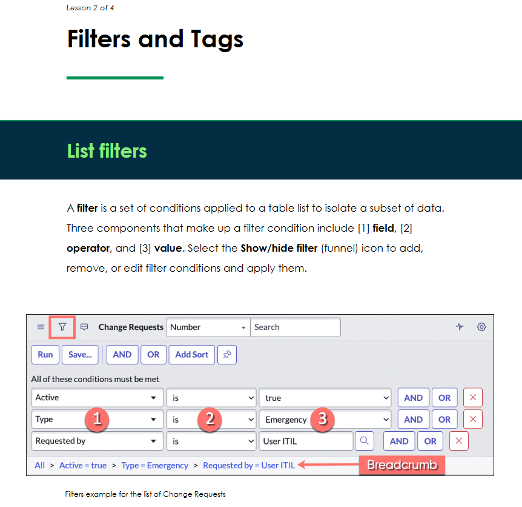
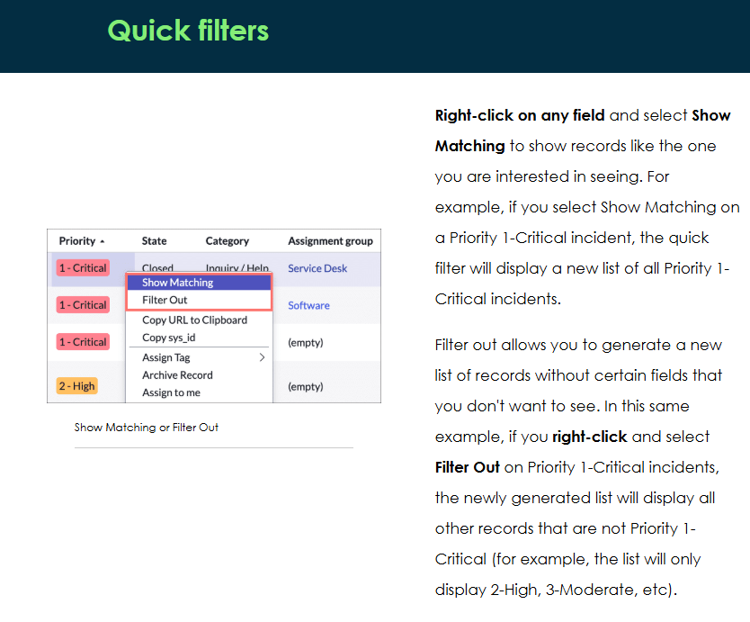
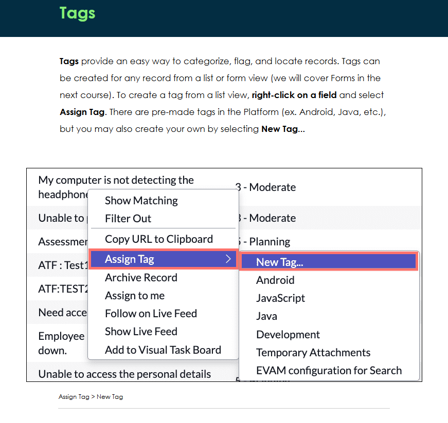

Field operators will change depending on field data types. Review examples of each below.

Text value: is, is not, contains, is one of, starts with, ends with.

Numeric: is, is not, greater than, less than, greater than or is, less than or is.

Date: on, before, after, between, is more than, is less than.

