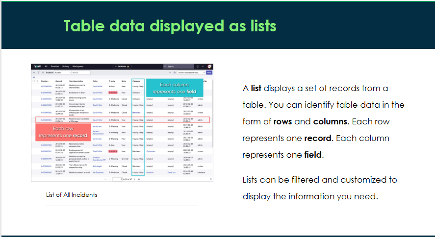
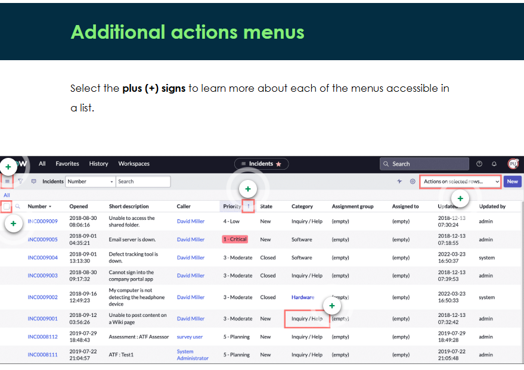
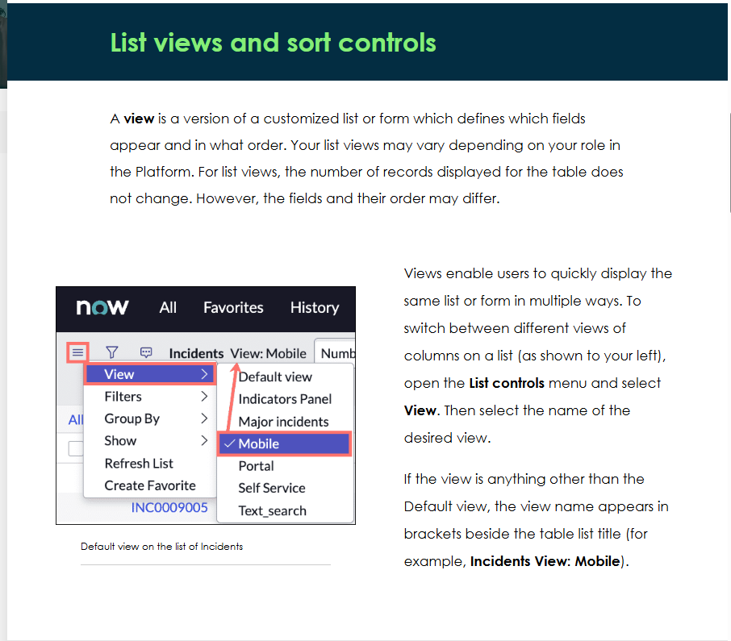
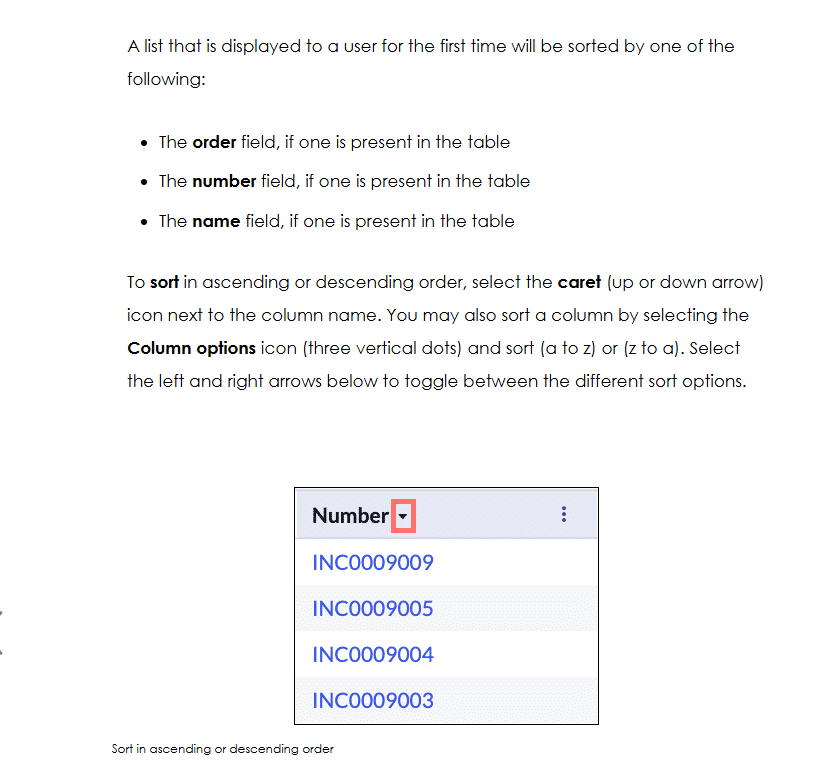
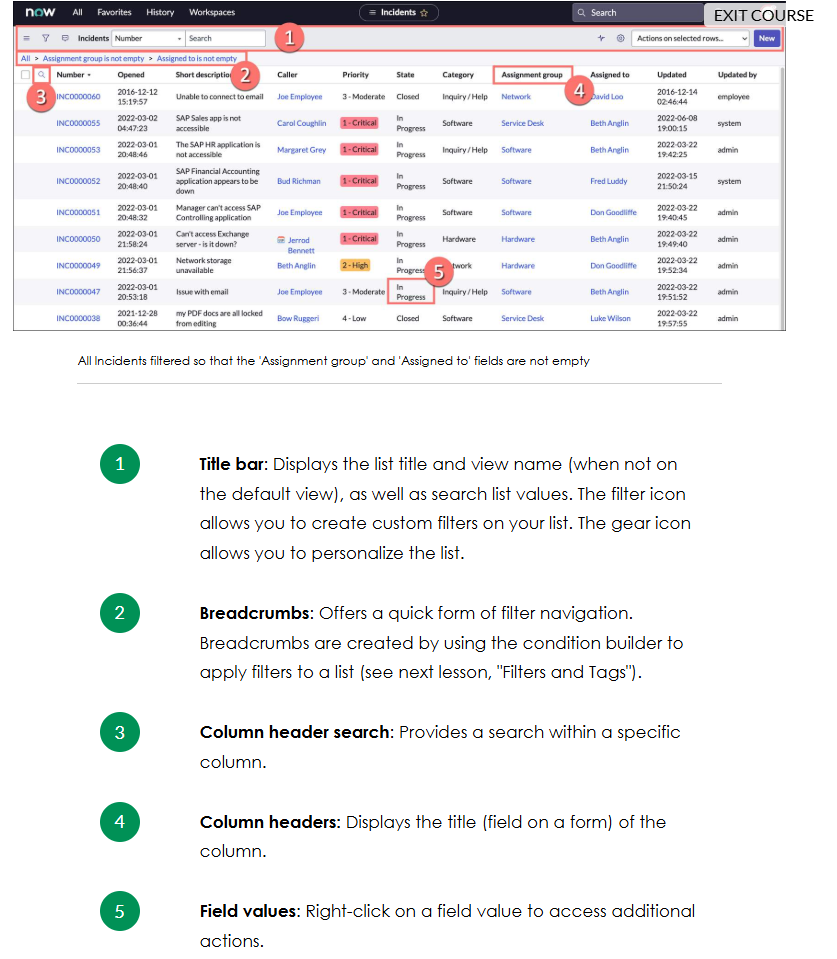
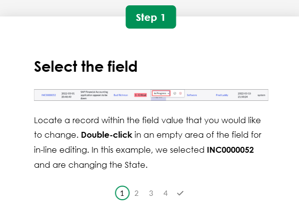
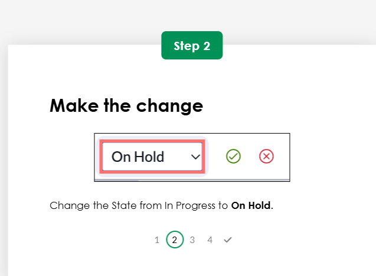
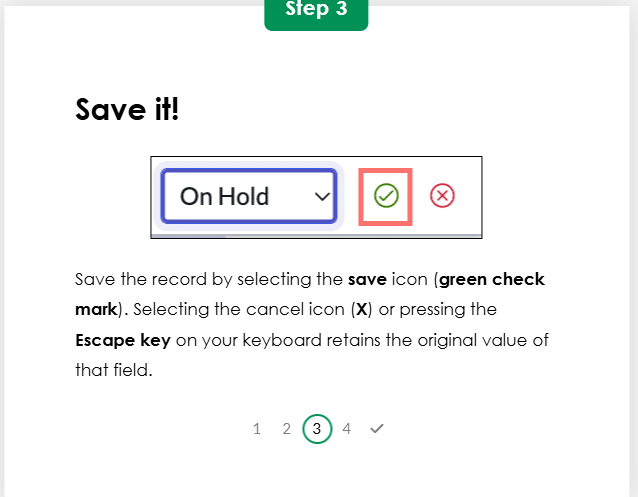
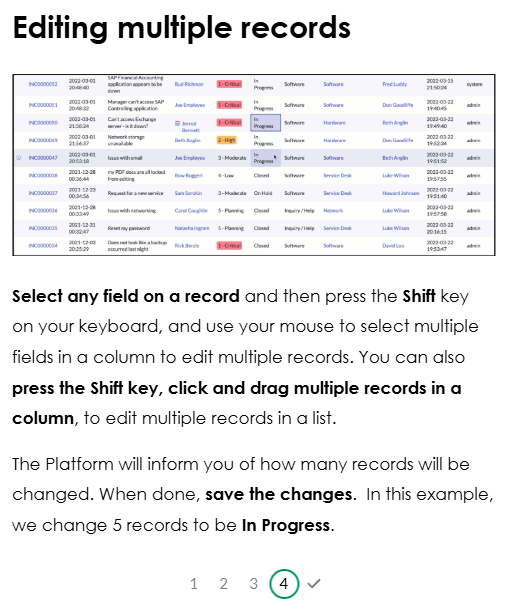

List Views and Personalization

List anatomy
Although lists display data captured in different tables, their interface remains consistent with common features. 

List personalization (logged-in user)

inline editing

