Data Visualization in ServiceNow

What is Platform Analytics?

ServiceNow data can be viewed and analyzed (in real-time or over time) by you and your colleagues. Data can be visually represented in many ways, including bar charts, pie charts, dials, lists, pivot tables, donuts, and more. 

Visualizations can be run manually or scheduled to run automatically. There are a range of predefined visualizations that pertain to applications and features like Incident Management and Service Catalog requests, including Key Performance Indicator (KPI) charts. 

You can create your own visualizations by navigating to All > Platform Analytics > Analytics Center module. From there, you may select Create new dashboard or Create New visualization. 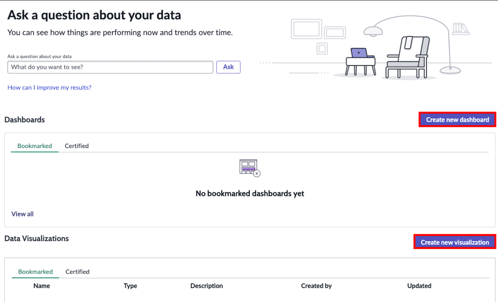

Alternatively, you can simply select most column context menus in any list to generate a visualization directly from the data in that list. Visualizations are interactive, in that users with access can drill down into the data to view and manipulate the underlying records.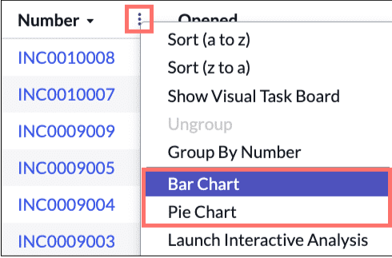

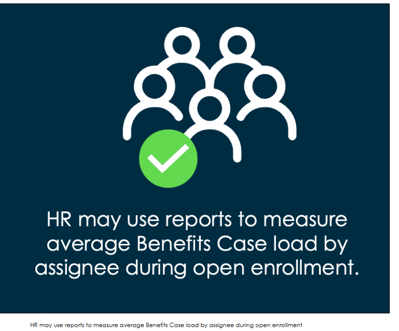

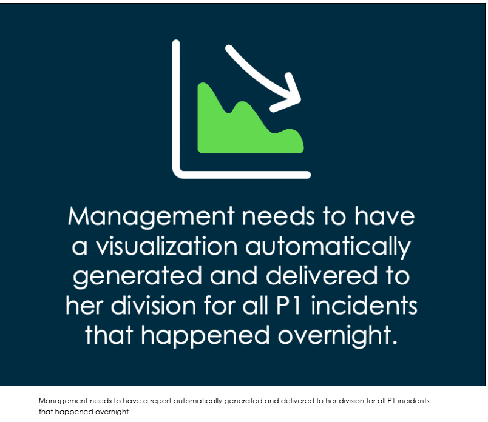
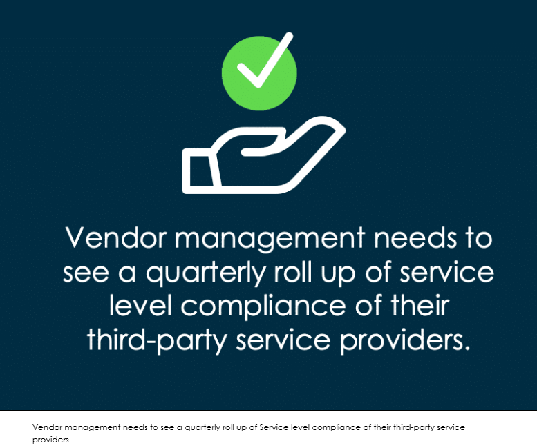

Types of visualizations

In the activity below, you will see how to access the Visualization Designer and see all the different types that are available to build your visualization. You may follow along in your instance by navigating to All > Platform Analytics > Analytics Center, then select Create new visualization.

Alternatively, you can navigate to All > Platform Analytics > Library > Data Visualizations, then select New (which is the path shown in the example below). 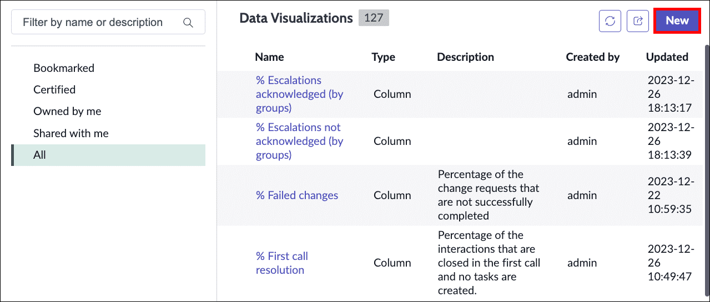

Select Start to begin, and use the the left and right arrows to view each step in the activity.
Add sources:
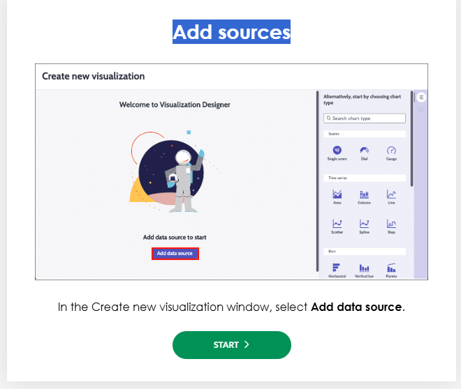
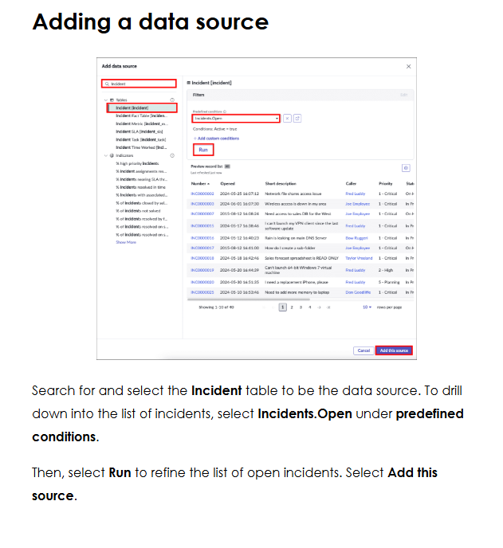
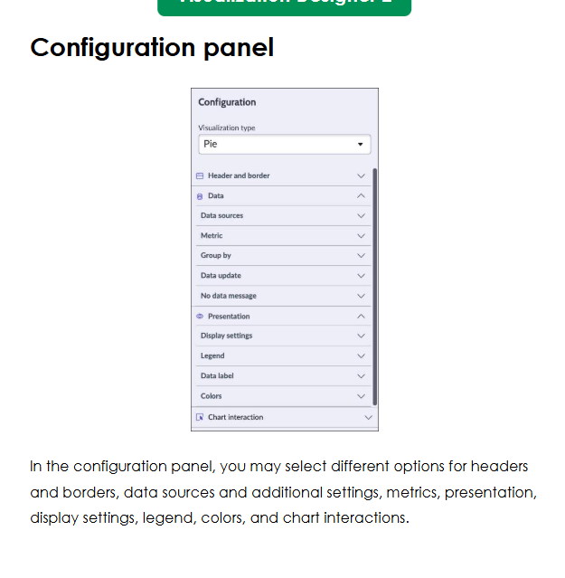
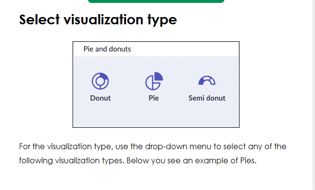
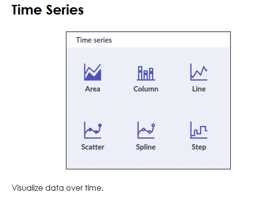
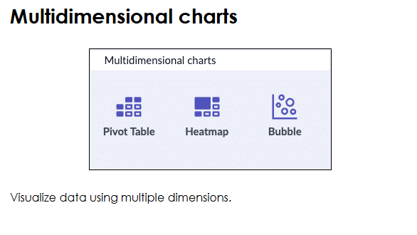
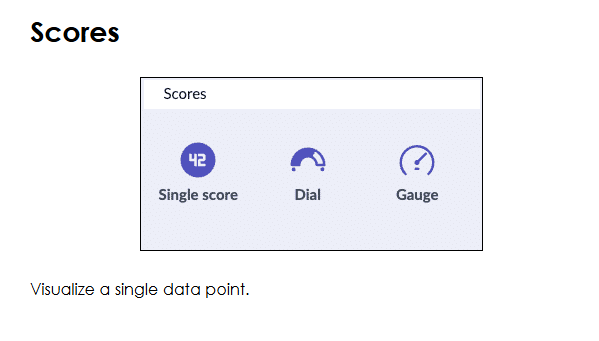
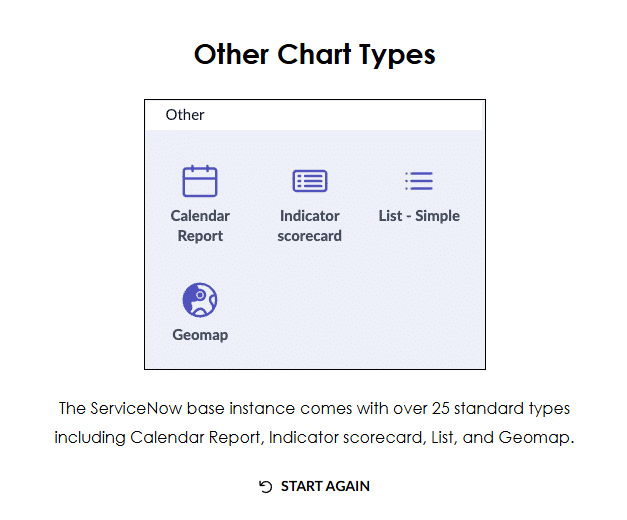

ServiceNow Platform Analytics can easily answer questions such as: 

Did I meet an SLA?

How many incidents did my team close in a month?

(Metric reporting) What was the average time from Incident open to Incident closed for each Service Desk team?

Advantages of the Visualization Designer

In the next section, you will have the opportunity to explore the Visualization Designer in greater detail. Here are just a few advantages to using it! 

•
Leverage visibility and available visualization types

•
Use multi-level filters, filter operators, and sort order to refine data presentation

•
View, create, edit, and schedule visualizations

Create, View, Edit, and Share:  Data Visualization configurations

The Data Visualizations module contains a library of visualized data which you can run and use to create your own custom visualizations. Many of these visualizations came with the Platform and others can be created by your administrators specifically for your company. 

The Data Visualizations page contains different sections for visualizations which are visible to different audiences. Select each plus sign (+) below to learn more about each section.
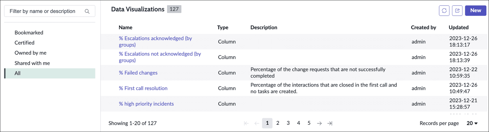
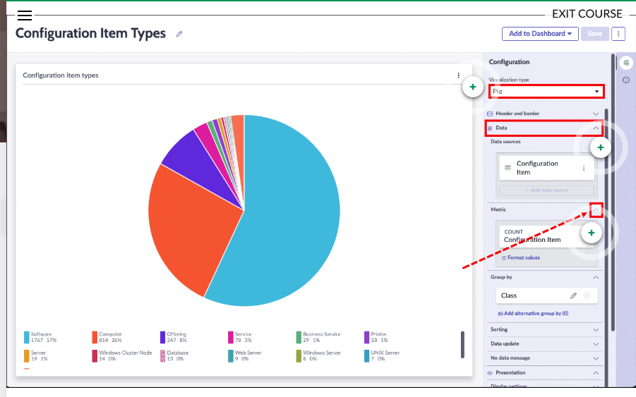

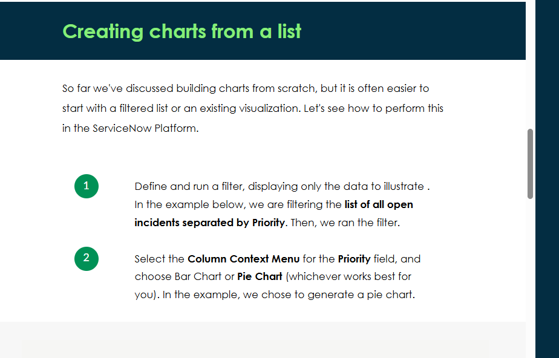
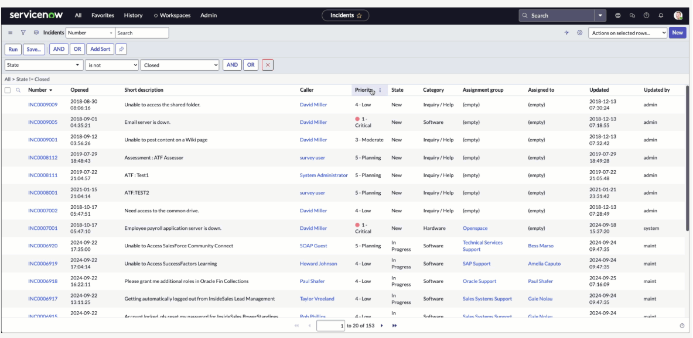

Platform Analytics and Dashboards

Platform Analytics vs. one-time reporting
You may be wondering what the difference between Platform Analytics (PA) and building a one-time visualization is in the ServiceNow Platform. When you build a chart from data in a table, (for example, Incident or Problem), information about the current state of the Platform data displays. Platform Analytics provides information about performance iteratively, over time for data visualizations and dashboards. 

Create management dashboards, report on KPIs and metrics, and increase quality and reduce the costs of service delivery through Platform Analytics. Visit ServiceNow Product Documentation to learn more! 

Dashboards enable you to display multiple Platform Analytics, data visualizations, lists, and other widgets on a single screen. Use dashboards to create a story with data that can be shared. Dashboards can be responsive or non-responsive. Responsive dashboard functionality is enabled by default. Non-responsive dashboards have limitations including who can create, view, and edit them. 

With dashboards, you can:

Share Platform Analytics and data visualizations on both Workspaces and Core Platform dashboards

Create and edit Platform Analytics data and other widgets directly from the dashboard

Use the Add new element button to quickly find and preview widgets, then add them to the dashboard

Easily share dashboards with other users from the integrated sharing pane

Use quick layouts to snap widgets into a predefined layout, then adjust the layout as desired

Set dashboards as your homepage

Create a dashboard
Navigate to All > Self-Service > Dashboards to view dashboards in the ServiceNow Platform. View recent dashboards, bookmarked or certified ones, dashboards owned by you, shared with you, or all available dashboards in your instance. You may also filter and search for certain dashboards by name. In this course instance, you can see examples of existing dashboards that were created by the System Administrator. To create your own, select Create new dashboard. 