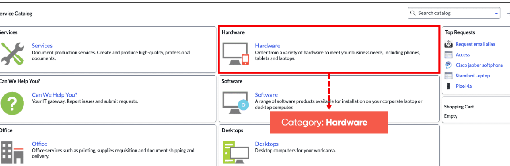
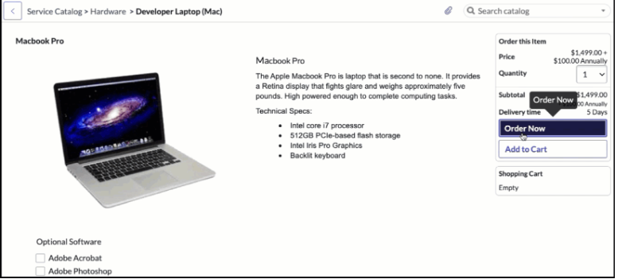
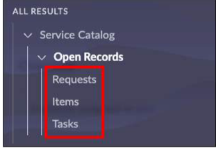
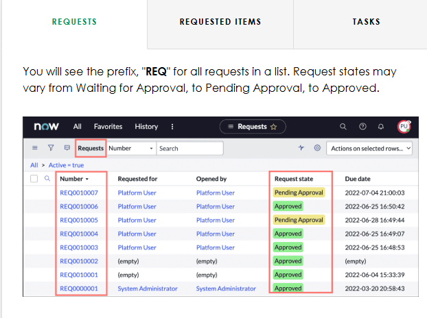
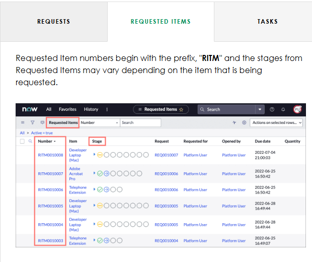
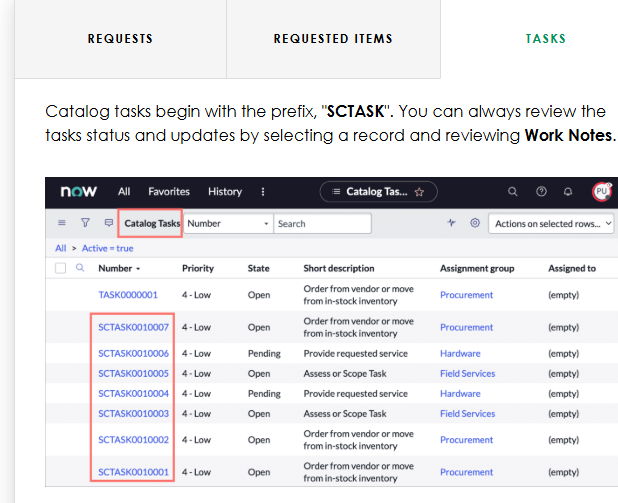
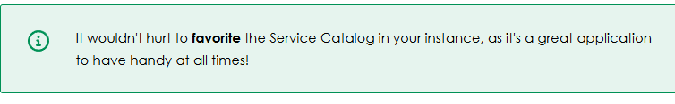

What is Service Catalog?

The Service Catalog is a robust ordering system for services and products offered by various departments for users. 

Users can see a list of things they might need (to create a request for) or like to have – usually, but not limited to IT products and services.

The Service Catalog in your instance allows you to request IT Services, report issues, order office supplies, request accessories for hardware, request hardware and software for your work area, and request mobile devices to help you get work done. The different categories you will see below, organize catalog items into logical groups. For example, if you select the Hardware Category, the catalog items include laptops, desktop, mobile devices, and more! 

Ordering an item

When you select a catalog item, you can specify whichever options that are associated with it and when ready, select Order Now. For example, by ordering a laptop you can select optional software before ordering the item. 

Requests, requested items, and tasks 

Once a catalog item (requests, requested items, and/or tasks) has been ordered, you may check on the status of the item by navigating to All > Service Catalog > Open Records, and select Requests, Items, or Tasks.

Think of Requests as a shopping cart for the requested items within them. Tasks and approvals are associated with requested items and the appropriate person in the Platform will have the ability to fulfill them. 

