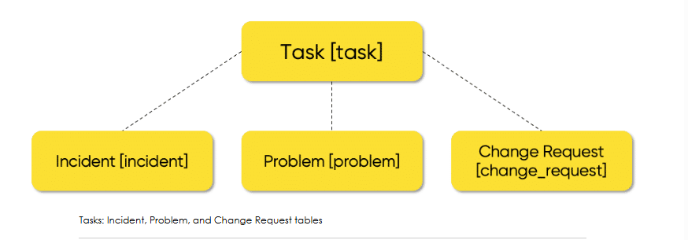
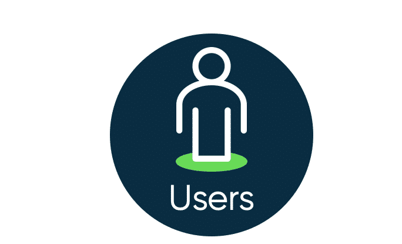
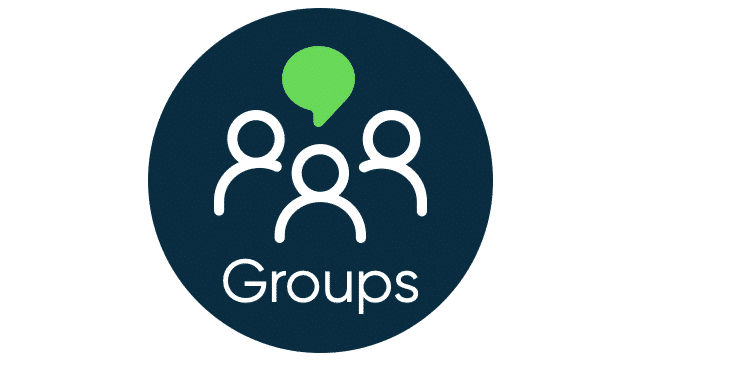
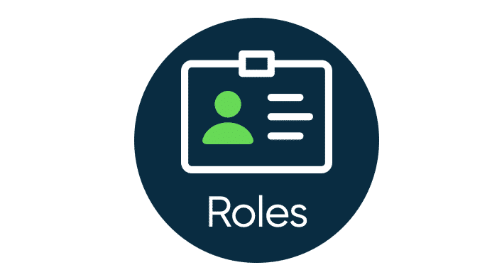
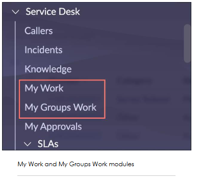
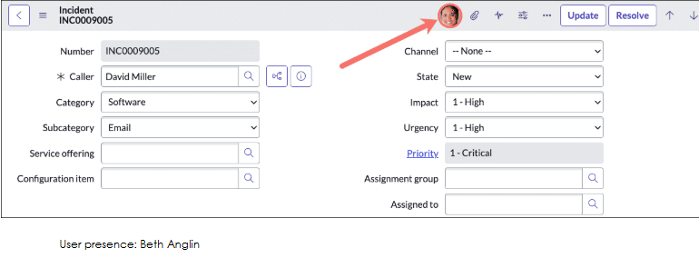
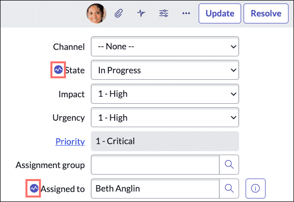
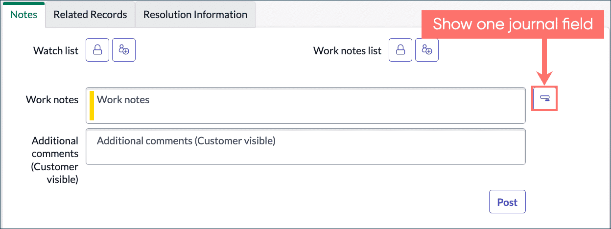
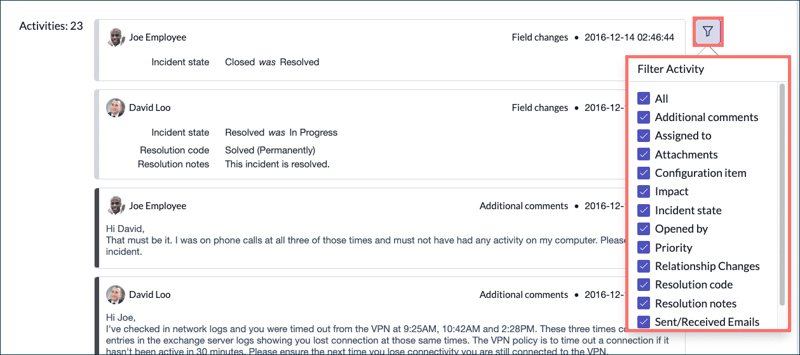
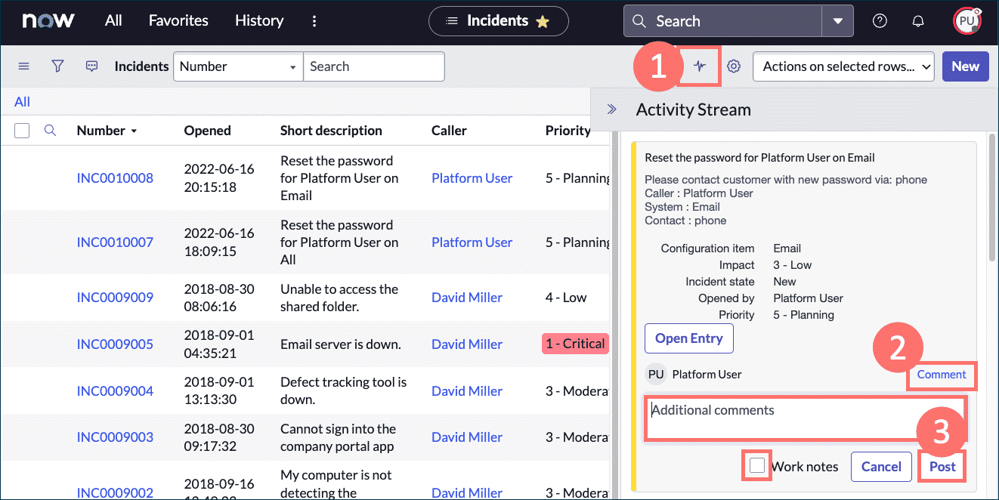

Tasks in the ServiceNow Platform
A task is any record that can be assigned to or completed by a user in ServiceNow. They are updated as the work defined by the task is completed (moved to a Closed state). Tasks can be assigned to specific users or user groups.  

If you can recall from the Lists & Filters and Forms lessons, you can access data in ServiceNow through records. Each record lives in a table in the Platform. The Task [task] table is one of ServiceNow's core tables and provides a series of standard fields used on each of the tables that extend it ("child" tables that come from the "parent" table), such as the Incident [incident] and Problem [problem] tables. 

Assignments

In ServiceNow, you will experience task assignment through Users, Groups, and Roles. Every user (that's you!) can be assigned to a group. It's not good practice to assign roles to individual users. For organizational practices, it's best to assign roles to a group that contains users.

To gain a better understanding of who is assigned what in the Platform, select the left and right arrows below.

1. Users can belong to more than one group. Every user belonging to a group inherits that group's roles. They can be assigned permissions to: 

Approve, change, or resolve incidents and requests

Provide a reference for alerts and notifications

Receive email notifications

2.Groups identify a subset of users based on roles. Group names are unique in ServiceNow. Tasks can be assigned to groups and then to single users belonging to that group. A group may also contain other groups in the Platform. 

3.Roles control access and permissions to features and capabilities in applications and modules. For example, the "admin" role provides access to all features and capabilities and can grant access to other roles, groups, and users in the Platform.

My Work/My Groups Work

The Service Desk application menu allows you to locate all work assigned to your group(s) or to you. 

The"itil" role (what you are assigned in the Platform for this course) is required to access the My Work (All > Service Desk > My Work) and My Groups Work (All > Service Desk > My Groups Work) modules in the Service Desk application.

My Work: list of all active tasks assigned to you, including:

Change Request

Group Approval

Incident

Knowledge Base Submission

Request

Security Case

Visual Task Boards

My Groups Work: list of all active tasks assigned to your group(s) but not yet assigned to an individual.

User Presence

The User Presence feature facilitates synchronous collaboration within one record. See who is online, view their current status, and what they are viewing or editing, all in real-time. 

Imagine a scenario in which you are viewing a critical issue documented in a Priority-1 record. User, Beth Anglin, needs to view and update the record simultaneously. That's where user presence comes in! The number of active viewers is listed in the form header. If only one additional user is viewing the record (as seen above), their avatar in the Platform will appear. Let's take a look and see how Beth edits the record while you are viewing it.

Real-Time Editing

Edit records in real time and see edits saved by other users, improving collaborative efforts. Real-time editing is an extension of User Presence. It allows you to work with others on the same record, indicating their state (editing or viewing). You can view the fields that are being edited, indicated by a "pulse" icon. Beth Anglin has just assigned the incident to herself. 

To keep up with what is changing in a record, select the Show Activity Stream icon to jump to the record Activity section, which includes the record history and updates by you and other viewers. You can see in the Notes section, that Beth has assigned the record to herself, and the state of the record has changed from New to In Progress.

Notes and Activities

Work Notes and Additional Comments

On a record, you can use the Notes tab to communicate to stakeholders and document task activities throughout the task's lifecycle. The Show all journal fields icon allows you to display multiple fields under the Notes tab, including Work notes and Additional Comments.

Once enabled, you can then select the Show one journal field icon to only display the Work notes field. If the Work notes field is the only field displayed, you may select the Additional Comments (Customer visible) checkbox (not shown below, but you may practice this in your instance). Otherwise, the customer will not be able to see what you posted. 

NOTE: When responding to an email from ServiceNow, do not change the Subject as it may not be saved to the correct record. 

Activity section 
The Activity section located under the Notes tab provides a complete history of a record, from creation through closure. It details who made an update, what the update was, and when the update was made. Selecting the filter (funnel) icon allows activity information to be filtered, based on your desired categories of information. 

Activity Stream inline editing 

The Activity Stream inline editor enables users to contribute to work within a record without opening a form. Just like real-time editing on a form, inline commenting on the activity stream means you can annotate records as updates are made, allowing multiplied efforts across several pieces of work simultaneously. To do so, navigate to a list of active task records, then follow the steps below. 

1.Select the Show Activity Stream icon and it will appear in a flyout window from the list header. 

2.With the window open, scroll down to browse the records recently updated and hover over an update you wish to comment, then select Comment. 

3.Enter your comment into the text field, (select the checkbox for Work Notes or Additional comments (Customer visible) if applicable), then select the Post button. 
