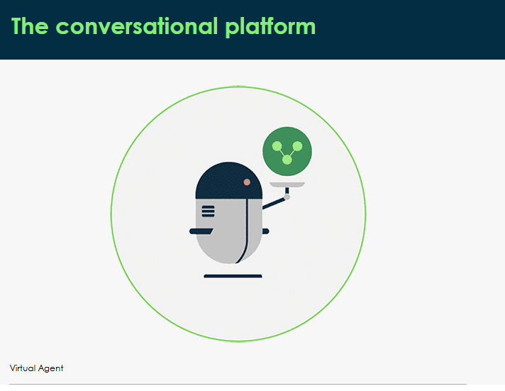
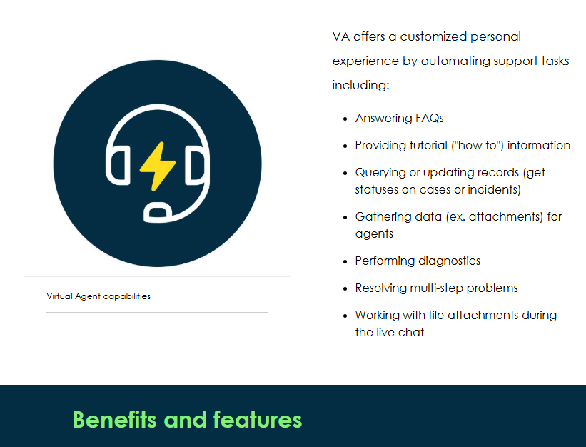
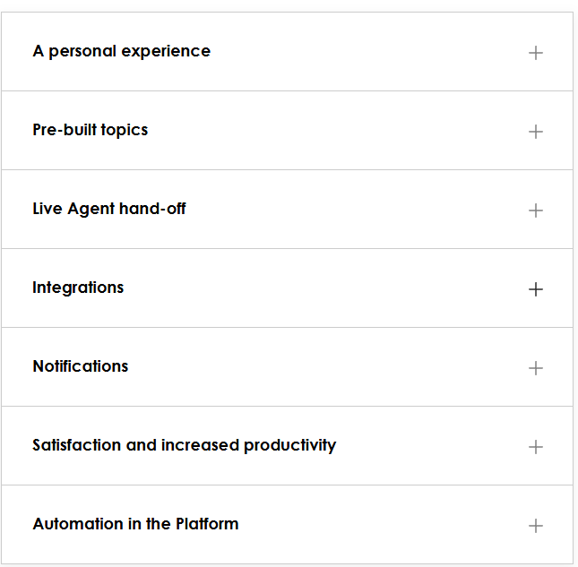

Virtual Agent (VA) is an artificial intelligence (AI) powered conversational chatbot in the Platform to get work tasks done more quickly and efficiently. VA refines your support experience, provides any time self-service, and increases deflections and agent productivity. In this course, you will have an opportunity to interact with Virtual Agent but will also learn about: 

How VA integrates with other messaging interfaces to support your organization

Which daily work tasks can benefit from this feature in the Platform

Personalized experiences through pre-built topics

How notifications and automation is supported through a chat interface

Virtual Agent (VA) is a friendly messaging interface that provides immediate help in the Platform, day or night! VA helps you make decisions, perform common work tasks, and browse information stored in Knowledge Bases, Service Catalog, and more! It offers a web-based interface available to Service Portal, iOS, and Android mobile environments, as well as third-party messaging applications through ServiceNow adapters for Slack and Microsoft Teams. 

Through live agent support, users have the option to switch to a human agent for assistance at any time, ensuring they receive the help they need.  

1.VA uses the ServiceNow Platform to deliver intelligent, personalized, and meaningful conversations that can help you get your work done. 

2.his AI-powered chatbot deploys conversations using templates for different environments including HR, IT, customer service, and more! 

3.If you have not found a solution with VA, you can always interact with a live agent. The entire conversation history and context is transferred to the right agent so they can quickly address any escalations and resolve user issues.

4.Connect with VA using web portals, Now® Mobile apps, and collaboration messaging interfaces like Slack, Microsoft Teams, and Facebook Messenger. 

5.Deliver real-time alerts and status updates to employees including notifications and SMS notifications. Quickly collect feedback for critical decisions and resolve requests faster and more efficiently. 

6.With VA, your organization has the ability to automate common support tasks and scale support, which frees up agents and technicians to focus on more complex user issues. 

